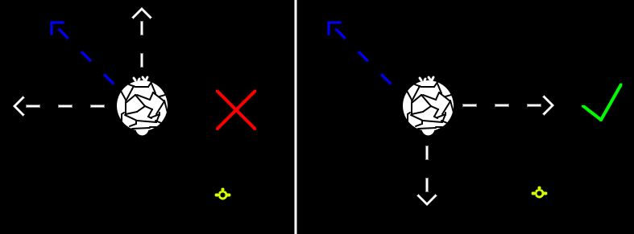

# Invert Target Lock Lines

Flips the relative velocity indicators for locked targets around. Now they show your velocity relative to the target. Matching target trajectory now means moving to make the arrows smaller.
